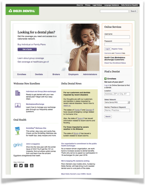

## Problem:

Given growing industry demand for Accessible online services, a portfolio of legacy sites, and limited in-house expertise, we need to comply with Section 508 of the American Disabilities Act while re-branding and consolidating the online presence.

## Solution:

The site needed a complete overhaul. We adopted the newly published WCAG 2.0 recommendation as enterprise standard and engaged outside agencies to update the site and transform web publishing.

## Result:

Solution remains accessible and robust ten years on. It proved to management that accessibility and looks are complimentary and affordable. It helped us win group contracts and keep customers.

The site complies with new 2018 revamped Federal Accessibility standards. The site continues to be compatible with new browsers and device rollouts. And, the policies we adopted prepared us to quickly meet 2014 Affordable Care Act requirements and support our health exchange strategy.
 