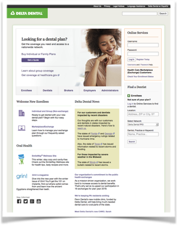

<article class="case-study">
    <header> <a class="breadcrumb" href="../portfolio/index.html">Portfolio</a>
        <h1> UX Accessibility </h1>
    </header>
    <h2>Problem:</h2>
    
 Given growing industry demand for Accessible online services, a portfolio of legacy sites, and limited
        in-house expertise, we need to comply with Section 508 of the American Disabilities Act while
        re-branding and consolidating the online presence. 

    <h2>Solution:</h2> 
    
 The site needed a complete overhaul. We adopted the newly published WCAG 2.0 recommendation as
        enterprise standard and engaged outside agencies to update the site and transform web publishing.

    <h2>Result:</h2>
    
Solution remains accessible and robust ten years on. It proved to management that accessibility and looks
        are complimentary and affordable. It helped us win group contracts and keep customers.

    
The site complies with new 2018 revamped Federal Accessibility standards. The site continues to be
        compatible with new browsers and device rollouts. And, the policies we adopted prepared us to quickly
        meet 2014 Affordable Care Act requirements and support our health exchange strategy. 

</article>
 