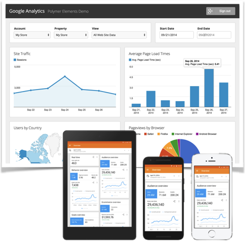

## Problem:

Given no reliable web analytics tracking. We could not observe user technologies and behavior nor segment audiences. There were no metric standards. Many applications were black boxes. Internal users could not understand the data, and worse used it incorrectly. 

## Solution: 

Implemented simple pageview tracking on the main public site using Google Analytics free version. Adopted SEOMoz to track search engine performance and competitor trends. 

Created web analytics program: Drafted web and campaign tracking guidelines. Managed sitemaps, content inventories, URL naming, and metadata to provide consistent, human readable data. And, trained managers, agencies, vendors, and developers on planning, implementation, and use. Published semi-annual user experience trend reports. 

Collaborated with Enterprise Analytics teams to lobby for standardization of metrics and event tracking across channels. 

## Result:

Initial implementation won funding to expand analytics to other web applications. The user community grew from 3 users to over 100 users across the enterprise. Analytics were used to show website value, inform strategy and investment decisions, identify opportunities and problems, and debug support tickets. 

Choice of free version fit organizational needs and saved enterprise millions of dollars over ten years and gives them an upgrade path when needs change. 
