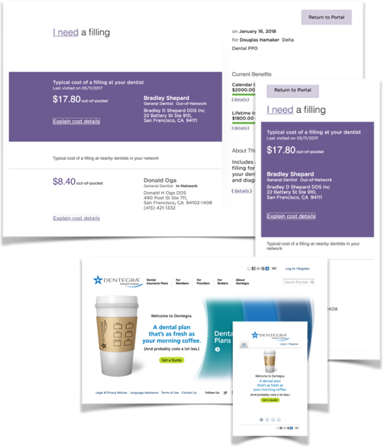

<article class="case-study">
    <header> <a class="breadcrumb" href="../portfolio/index.html">Portfolio</a>
        <h1> UX Responsive Design </h1>
    </header>
    <h2>Problem:</h2>
    
 Given increasing mobile traffic, growing customer expectations for mobile access, new of user agents and
        devices, and rapidly evolving display and input modes. 

    <h2>Solution:</h2> 
    <!--   -->
    
 Implemented the W3C’s "One Web" vision within our Accessibility Policy. Created a standards-based web
        framework around semantic markup and progressive enhancement techniques, including Responsive Design for
        mobile accessibility. And evangelized Web Standards Principles, Accessibility, and HTML5 standards and
        best practices across the organization. 

    <h2>Result:</h2>
    
 The accessible site launched in 2008 was “mobile-friendly” when Google introduced mobile factors in
        rankings. A government client was delighted in 2010 when we delivered a responsive site as a ‘mobile
        accessibility’ feature. We won executive funding and launched our first responsive full corporate site
        in 2014. And, our internal development teams adopted ‘responsive’ for new applications development in
        2016. 

</article>