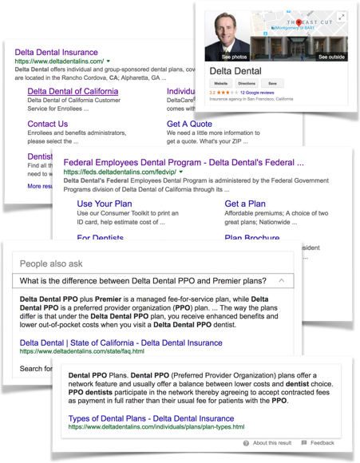

<article class="case-study">
    <header> <a class="breadcrumb" href="../portfolio/index.html">Portfolio</a>
        <h1> UX SEO </h1>
    </header>
    <h2>Problem:</h2>
    
 Given no SEO plan, weak content, and legacy sites with good domain authority, a site relaunch threatened
        findability and provided an opportunity to create a strategic plan. 

    <h2>Solution:</h2> 
    
 Piggy-backed on an existing redesign to improve SEO strategy and performance for small incremental cost.
    

    
 Accessibility and Plain Language compliance provided better access to humans; and, it made content more
        understandable to Google and improved search relevance. A new site architecture better targeted
        audiences, their needs, and their vocabulary; and, it created a broader and more relevant search
        footprint. Structured markup techniques improved Accessibility for humans and browsers; and, they
        improved Search readability and influenced advanced search features. New guidelines for naming URLs,
        titles, descriptions, and headings improved navigation, readability, and messaging; and, they
        strengthened keyword relevance. 

    
 Led collaboration and evangelized best practices with editorial, marketing, and product managers to
        improve content relevance, consistency, and quality. Trained teams, advised SEM campaigns, and reviewed
        external Agencies proposals and plans. 

    
 In addition, implemented Google Analytics, Google Search Tools, and SEOMoz to track behavior and search
        performance. Created redirect plan to transfer domain authority and preserve SERP rankings. And, tuned
        search presentation through robots.txt, sitemaps, and Google Search configurations.

    <h2>Result:</h2>
    
 A robust Search framework at minimal cost and no delay. Held 3 of top 10 organic results for critical
        keywords from 2010 to 2016. And, received emerging search features like site links, questions, and info
        cards. 

</article>